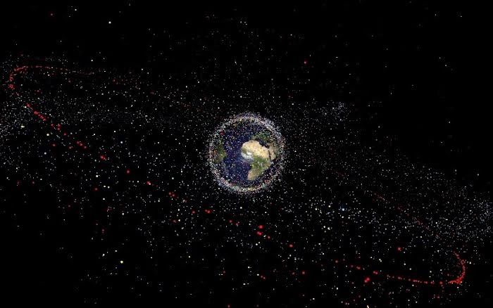
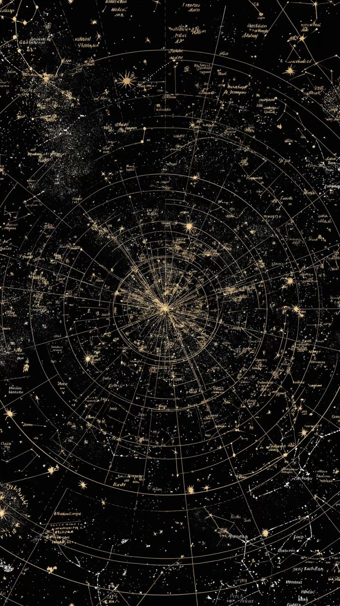

# Ariadne

## Astrodynamics, Orbit Estimation and Conjunction Assessment Framework

Ariadne is a research focused astrodynamics framework for orbital propagation, reference frame transformations, uncertainty aware state estimation and conjunction assessment.

The project combines orbital mechanics, numerical computation and statistical estimation methods to analyse spacecraft trajectories, estimate orbital states and evaluate potential close approaches between space objects.

## Features

## Orbital Propagation

Ariadne provides tools for modelling and predicting spacecraft trajectories using orbital state information.

Capabilities include:

• TLE parsing and orbital element extraction  
• Satellite orbit propagation  
• Future state prediction  
• Orbital trajectory analysis  
• Propagation validation against standard reference data  

## Reference Frame Transformations

Accurate coordinate transformations are essential for spacecraft tracking and observation modelling.

Supported transformations include:

• Earth Centered Inertial coordinates  
• Earth Centered Earth Fixed coordinates  
• Topocentric observation frames  
• Azimuth, elevation and range calculations  
• Orbital observation geometry  

## Measurement Simulation

Ariadne provides configurable observation simulation for developing and testing orbital estimation systems.

Features include:

• Synthetic tracking observations  
• Range measurements  
• Angular measurements  
• Sensor noise modelling  
• Ground truth trajectory generation  

## Orbit Determination

Ariadne estimates spacecraft states from imperfect tracking observations using nonlinear estimation methods.

Supported methods:

• Batch least squares estimation  
• Extended Kalman Filter  
• Unscented Kalman Filter  

Capabilities include:

• State prediction  
• Measurement updates  
• Covariance propagation  
• Uncertainty estimation  

## Statistical Validation

Ariadne validates estimation performance through statistical consistency analysis.

Validation methods include:

### NEES

Normalized Estimation Error Squared

Evaluates whether predicted uncertainty matches actual estimation error.

### NIS

Normalized Innovation Squared

Evaluates whether measurement residuals are consistent with the assumed observation model.

## Conjunction Assessment

Ariadne provides space object encounter analysis for evaluating orbital close approaches.

Capabilities include:

• Relative state computation  
• Closest approach determination  
• Encounter geometry analysis  
• RIC frame analysis  
• Covariance combination  
• Probability of collision estimation  
• Hard body radius modelling  

## Space Object Screening

Ariadne supports orbital catalog analysis for identifying potential conjunction events.

Features include:

• Satellite catalog processing  
• Candidate filtering  
• Orbital screening  
• Encounter risk identification  

## Real World Validation

Ariadne is evaluated against publicly available orbital data and historical conjunction scenarios.

Validation includes:

• Standard propagation verification cases  
• Real satellite tracking scenarios  
• Historical conjunction analysis  
• Predicted versus reported encounter comparison  

## Documentation

The documentation provides:

• API references  
• Mathematical explanations  
• Usage examples  
• Validation experiments  
• Scientific references  

## Testing and Quality

Ariadne includes automated validation through:

• Unit testing  
• Numerical regression testing  
• Property based testing  
• Statistical consistency testing  
• Continuous integration checks  

## Scientific Foundations

Ariadne is built on concepts from:

• Orbital mechanics  
• Numerical methods  
• Probability theory  
• Bayesian estimation  
• Space situational awareness  

## License

MIT License
