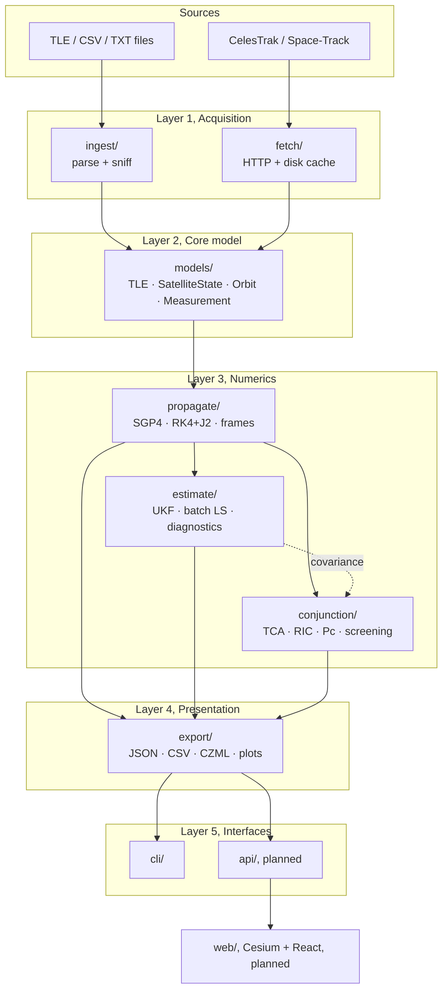
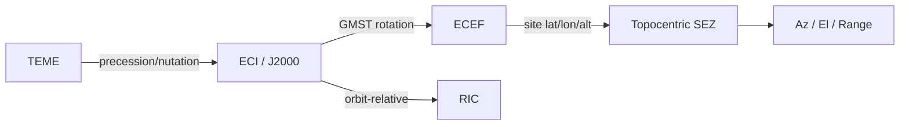
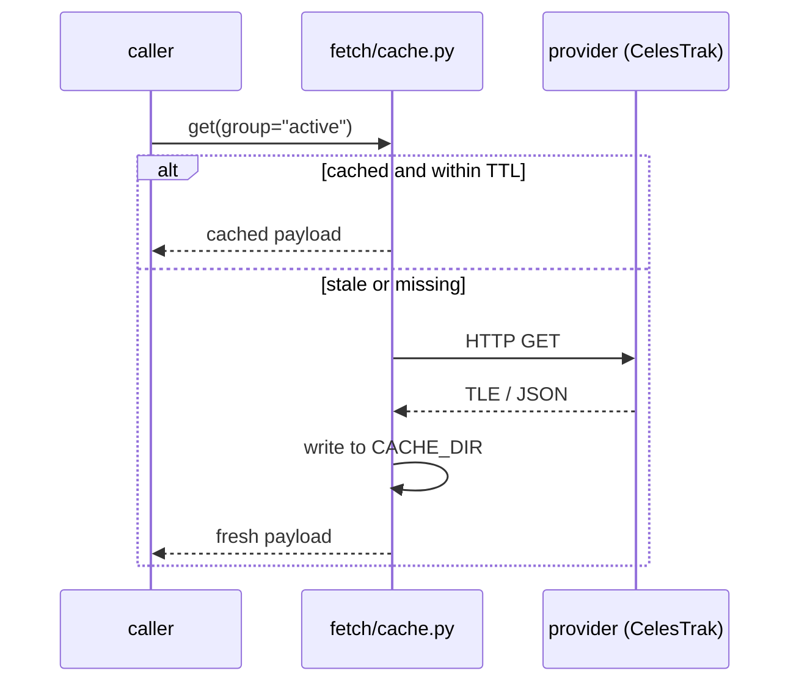
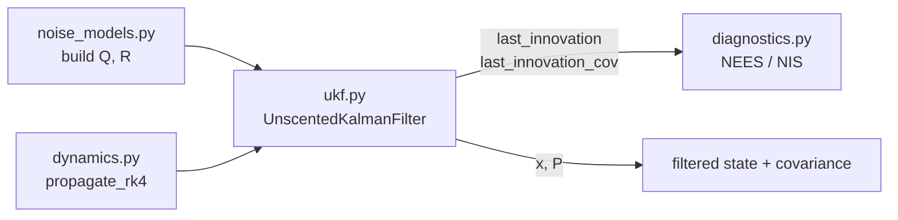
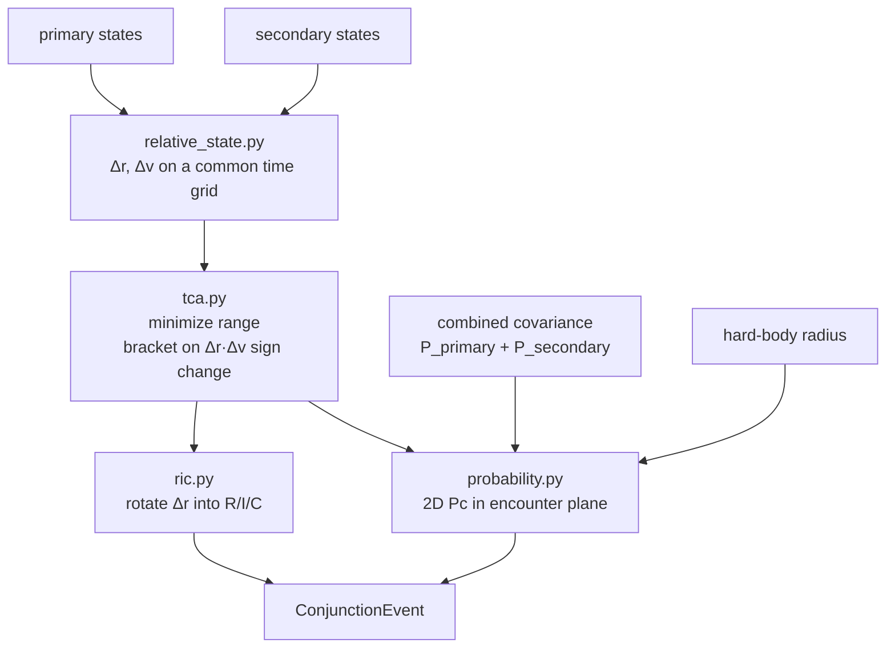
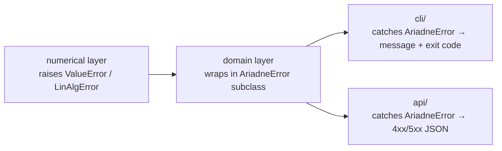
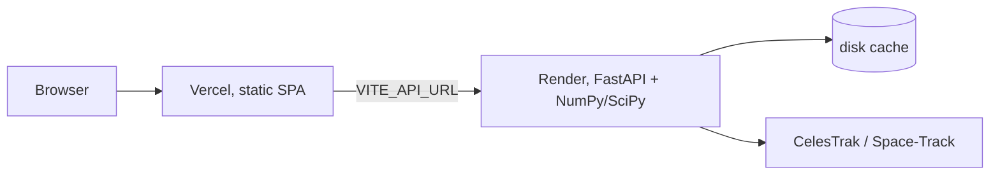

# Ariadne, Architecture

How the system is put together: layers, module contracts, data model, and the
rules that keep the pieces independent.

This is the design document. For *why* the math works the way it does, see
[`orbital-mechanics-and-estimation-primer.md`](orbital-mechanics-and-estimation-primer.md).
For *what gets built when*, see [`roadmap.md`](roadmap.md).

Status markers used throughout:

| Marker | Meaning |
| --- | --- |
| **[built]** | Implemented and in the tree today |
| **[stub]** | File exists, 0 lines, contract defined here, not yet written |
| **[planned]** | Not in the repo yet at all |

---

## 1. Design principles

1. **One state model, many sources.** TLE, CSV, plain text, or a live CelesTrak
   pull all normalize into the same `SatelliteState` before anything downstream
   touches them. No module downstream of `ingest`/`fetch` knows what format the
   data arrived in.
2. **Layers depend downward only.** `conjunction` may import `propagate`;
   `propagate` may never import `conjunction`. This is what lets the API layer
   (step 6) be purely additive.
3. **The library is the product; the CLI is a wrapper.** Every command is a thin
   argument-parsing shell over a function that is callable from Python. The
   FastAPI layer later calls those same functions, no logic lives in `cli/`.
4. **Units and frames are fixed, globally.** Kilometres, kilometres/second,
   radians, UTC. Declared once in `ariadne/constants/`. Any function taking
   degrees or metres names it explicitly in the parameter (`elevation_deg`).
5. **Uncertainty is a first-class output.** A state without a covariance is
   half an answer. Propagation, estimation, and conjunction all carry `P`
   alongside `x`.
6. **Numerical code is pure.** No I/O, no logging side effects, no global state
   inside `propagate`/`estimate`/`conjunction`. Makes them trivially testable
   and safe to call from a request handler.

---

## 2. System layers



**Import rule, enforced by review:** a module may import from its own layer and
any layer above it in this list, never below.

```text
constants, exceptions, utils   ← leaf, imported by everyone
models                         ← may import leaf
ingest, fetch, propagate       ← may import models + leaf
estimate, conjunction          ← may import propagate, models + leaf
export                         ← may import anything numeric
cli, api                       ← may import everything; nothing imports them
```

**Known deviation:** `estimate/dynamics.py` **[built]** carries its own copies of
`MU_EARTH`, `R_EARTH`, `J2` rather than importing `ariadne.constants`. This is
deliberate and documented in the constants module, the UKF calls
`propagate_rk4` once per sigma point per step (13 calls/step for a 6-state
filter), and the module is kept self-contained as a tight inner loop. The values
are identical; if either changes, both change. This is the only sanctioned
duplication in the tree.

---

## 3. Conventions

### Units

| Quantity | Unit | Notes |
| --- | --- | --- |
| Distance | km | Never metres. `R_EARTH = 6378.137` |
| Velocity | km/s | |
| Acceleration | km/s² | |
| Angle | radians | Internal. Degrees only at I/O edges, suffixed `_deg` |
| Time (epoch) | `datetime`, UTC, tz-aware | Naive datetimes are rejected |
| Time (interval) | seconds, float | `dt`, `step_s` |
| Covariance | km², km²/s², km²/s | Blocks of the 6×6 `P` |

### Frames

Frames are never implicit. Every state carries the frame it is expressed in, and
`propagate/frames.py` is the only module allowed to convert between them.



- **TEME**, what SGP4 natively outputs. Nothing but `propagate/sgp4.py` should
  produce it, and it should be converted to ECI immediately.
- **ECI (J2000)**, the canonical internal frame. All dynamics, estimation, and
  conjunction math happens here.
- **ECEF**, for ground tracks and site geometry.
- **SEZ / AER**, for observation modelling and measurement simulation.
- **RIC**, orbit-relative, used only at TCA for conjunction reporting.

### Time

- Epochs are `datetime` objects with `tzinfo=timezone.utc`.
- `utils/time.py` **[stub]** owns UTC ↔ Julian Date ↔ GMST conversions and the
  TLE two-digit-year epoch decoding.
- `JD_J2000 = 2451545.0` and `DAYS_PER_CENTURY = 36525.0` live in `constants`.

---

## 4. Core data model (`ariadne/models/`) **[stub]**

These four types are the contract every other layer speaks. They are plain
dataclasses, no behaviour beyond validation and cheap derived properties.

### `SatelliteState`, the universal currency

```python
@dataclass(frozen=True)
class SatelliteState:
    epoch: datetime          # tz-aware UTC
    position: np.ndarray     # (3,) km
    velocity: np.ndarray     # (3,) km/s
    frame: Frame = Frame.ECI
    norad_id: int | None = None
    name: str | None = None
    covariance: np.ndarray | None = None   # (6, 6), km²/km²s⁻¹/km²s⁻²

    @property
    def vector(self) -> np.ndarray:   # (6,) [x, y, z, vx, vy, vz]
        ...
```

The `vector` property is the bridge to the numerics layer: `estimate/` and
`propagate/numerical.py` operate on raw 6-vectors, and this is where they come
from. **Every ingest path and every propagator output is a `SatelliteState`.**

### `TLE`

Parsed two-line element set: `norad_id`, `epoch`, `inclination`, `raan`,
`eccentricity`, `arg_perigee`, `mean_anomaly`, `mean_motion`, `bstar`,
`classification`, `element_set_number`, `revolution_number`, plus the raw
`line1`/`line2` so the strings can be handed to the `sgp4` package verbatim.
Validation (checksum, column positions, field ranges) raises `TLEParseError`.

### `Orbit`

Keplerian element set derived from a `SatelliteState`, `a`, `e`, `i`, `raan`,
`arg_perigee`, `true_anomaly`, plus derived `period`, `apogee`, `perigee`. This
is what the dashboard's "Orbit Parameters" panel renders. Conversion both ways
(`from_state`, `to_state`) lives here.

### `Measurement`

An observation for the OD pipeline: `epoch`, `values` (n-vector), `kind`
(`POS_VEL` | `RANGE` | `AZ_EL` | `RANGE_RATE`), `noise_cov` (n×n), and optional
`station_id`. The UKF's current identity measurement model corresponds to
`kind=POS_VEL`.

---

## 5. Layer contracts

### 5.1 `ingest/` **[stub]**, files in, states out

| Module | Responsibility |
| --- | --- |
| `sniff.py` | Detect format from content, not extension. Returns an enum; dispatches to the right parser. |
| `tle.py` | 2-line and 3-line (with name) TLE files → `list[TLE]` |
| `csv.py` | Header-driven state vector CSV → `list[SatelliteState]` |
| `txt.py` | Whitespace-delimited state files → `list[SatelliteState]` |
| `schema.py` | Column-name aliases and required-field validation shared by the CSV/TXT parsers |

Every parser raises `IngestError` (or `TLEParseError`) with the offending line
number. Partial success is allowed on catalogs, a malformed entry in a
10,000-object file is collected into a `warnings` list rather than aborting the
run.

### 5.2 `fetch/` **[stub]**, the network edge

`celestrak.py` targets `https://celestrak.org/NORAD/elements/gp.php` with
`GROUP=` and `CATNR=` queries. `spacetrack.py` handles the
authenticate-then-query cookie flow, reading credentials from
`SPACETRACK_USERNAME` / `SPACETRACK_PASSWORD` (see `.env.example`), never from
CLI arguments, so they don't land in shell history.

`cache.py` sits *in front of* both providers, not beside them:



Cache keys are `(provider, query, fetch_date)`; TTL is configurable and defaults
to something on the order of hours. This matters because the dashboard polls:
without the cache, an idle browser tab becomes an unintentional DoS on a free
public service. Network failures raise `FetchError`; a stale cache entry is
preferred over a hard failure when the provider is unreachable, with the
staleness surfaced to the caller.

### 5.3 `propagate/` **[stub]**, the blocking dependency

Everything downstream needs this. Two propagators with a shared signature shape:

```python
def propagate_sgp4(tle: TLE, epochs: Sequence[datetime]) -> list[SatelliteState]
def propagate_numerical(state: SatelliteState, epochs: Sequence[datetime],
                        force_model: ForceModel = ForceModel.J2) -> list[SatelliteState]
```

- **`sgp4.py`** wraps the `sgp4` PyPI package (Vallado). It owns the TEME output
  and converts to ECI before returning, so TEME never escapes the module. A
  decayed/error return code from the underlying propagator becomes
  `PropagationError`.
- **`numerical.py`** is RK4/RK45 over two-body + J2 for propagation that isn't
  tied to TLE mean elements. This is the *outer* propagator, adaptive and
  general, distinct from `estimate/dynamics.py`'s fixed-step inner loop.
- **`frames.py`** implements the transform chain in §3. It is the single source
  of truth for rotations; duplicating a GMST calculation anywhere else is a bug.

### 5.4 `estimate/` **[built]**, the one complete subsystem



- `ukf.py`, scaled unscented transform (Van der Merwe), 6-state, identity
  measurement model. `predict(dt)` generates 13 sigma points, pushes each
  through `propagate_rk4`, and recombines; `update(z)` reuses those propagated
  points rather than regenerating them. Cholesky failures from covariance drift
  are handled by symmetrize-plus-escalating-jitter, and `P` is re-symmetrized
  after every update.
- `dynamics.py`, `two_body_j2_accel`, `state_derivative` (solve_ivp-compatible
  signature), `propagate_rk4`.
- `noise_models.py`, `build_measurement_noise(pos_sigma, vel_sigma)` and
  `build_process_noise_discrete_white_noise(dt, sigma_accel)`.
- `diagnostics.py`, `compute_nees`, `compute_nis`, `chi_square_bounds`,
  `run_nis_consistency_check` returning a `consistent` / `overconfident` /
  `underconfident` verdict.
- `batch_ls.py` **[stub]**, batch least squares. Slots in beside the UKF behind
  a shared estimator interface; reuses `dynamics.py` for the state transition
  and needs a state transition matrix (numerical Jacobian is acceptable).

**Extension point:** the identity measurement model is currently hardcoded in
`update()`. Supporting range/az-el observations means introducing an `h(x)`
callable and re-propagating sigma points through it, the sigma-point machinery
itself does not change. This is the one place `estimate/` will need to import
`propagate/frames.py`, since az/el requires site geometry.

### 5.5 `conjunction/` **[stub]**, composed from the layers above



- `relative_state.py`, differences two ephemerides that must share an epoch
  grid. Mismatched epochs are a `ValueError`, not silent interpolation.
- `tca.py`, coarse scan for sign changes in the range-rate (`Δr·Δv`), then
  Brent/golden-section refinement inside each bracket. Multiple minima in a
  window are all returned.
- `ric.py`, builds the RIC basis from the *primary's* state at TCA (radial
  along `r̂`, cross-track along `ĥ = r×v`, in-track completing the triad).
- `probability.py`, Foster/Alfano 2D Pc: project the combined covariance into
  the plane normal to relative velocity, integrate the Gaussian over a disc of
  the combined hard-body radius.
- `screening.py`, one primary against a whole catalog, with cheap geometric
  pre-filters (apogee/perigee overlap, then coarse range gate) before any
  expensive TCA refinement. This ordering is what makes an all-vs-one screen
  tractable.

**Reuse rule:** covariance propagation comes from `estimate/`. `conjunction/`
combines and projects covariances; it does not propagate them.

### 5.6 `export/` **[stub]**, the dashboard contract

- `czml.py` is the important one. It emits a CZML document: a `document` packet
  with clock/interval, one packet per satellite carrying
  `position.cartesian` as a time-tagged array, `path` styling, and separate
  packets for conjunction geometry (marker at TCA, line between objects). Cesium
  consumes this directly, this file *is* the visual layer's data format.
- `json.py` / `csv.py`, structured dumps of orbit parameters, filtered states,
  and conjunction results. The API layer serves these same shapes.
- `plots.py`, matplotlib ground tracks and RIC-plane plots, for reports rather
  than the live dashboard.

### 5.7 `cli/` **[stub]**, thin by mandate

`main.py` dispatches to `fetch`, `validate`, `propagate`, `od`, `conjunct`,
`screen` (names per the README). Each subcommand module parses arguments,
calls one library function, hands the result to `export/`, and catches
`AriadneError` to print a clean message instead of a traceback. Any subcommand
module that grows numerical logic has a bug in the wrong file.

`pyproject.toml` **[stub]** declares the `ariadne = ariadne.cli.main:main` entry
point and the dependency set (`numpy`, `scipy`, `sgp4`, `requests`, a CLI
framework, `matplotlib` as an extra).

### 5.8 Support modules

- `constants/` **[built]**, WGS-84 gravity, Earth shape/rotation, time, angle
  conversions. Sets the unit convention for the project.
- `exceptions/` **[built]**, `AriadneError` base with `TLEParseError`,
  `PropagationError`, `FrameTransformError`, `IngestError`, `FetchError`. The
  single-base design exists so the CLI has exactly one thing to catch.
- `utils/time.py`, `math.py`, `logging.py` **[stub]**, JD/GMST conversions,
  small vector/rotation helpers, logging setup driven by `LOG_LEVEL`.
- `config/settings.py` **[stub]**, env-driven settings (`CACHE_DIR`,
  `LOG_LEVEL`, Space-Track credentials). Read once, passed explicitly; not a
  global consulted from deep inside numerical code.
- `viewer/` **[stub]**, reserved for local visualization helpers, subordinate
  to the web frontend.

---

## 6. Error handling



- Programmer errors (wrong shape, wrong type) stay as `ValueError`/`TypeError`.
- Domain failures (bad TLE, unreachable provider, decayed orbit) become
  `AriadneError` subclasses at the module boundary.
- Only interface layers catch. Library code never swallows an exception to
  return `None`.
- Filter divergence is an exception, not a silent bad answer: the UKF's
  Cholesky guard raises `LinAlgError` once jitter regularization is exhausted.

---

## 7. Service layer (`api/`) **[planned]**

Additive, a new top-level package that imports `ariadne` and adds no logic of
its own.

| Endpoint | Returns |
| --- | --- |
| `GET /catalog` | Object list from `fetch/` (cache-backed) |
| `GET /objects/{id}/state` | Current `SatelliteState` as JSON |
| `GET /objects/{id}/orbit.czml` | CZML from `export/czml.py` |
| `GET /conjunctions/next` | Soonest event for a primary |
| `GET /conjunctions/screen` | Catalog screen above a miss-distance threshold |

Design notes:

- **Stateless request handlers.** Any per-object state lives in `fetch/cache.py`
  on disk, not in process memory, so the service can restart or scale without
  losing anything.
- **Screening is the one slow endpoint.** A full catalog screen is not a
  request-response operation at catalog scale; it needs a background task with a
  job handle, or a pre-computed screen refreshed on a timer.
- **CORS** restricted to the frontend origin.
- Fixing these response shapes is what unblocks parallel frontend work.

---

## 8. Frontend (`web/`) **[planned]**

CesiumJS globe fed by the CZML endpoint, inside a React/Vite shell: top bar
(scenario, UTC clock, object count), left icon rail, right panels for Orbit
Parameters and Next Close Approach, bottom object-detail bar. Dark background
with a gold (`#e8b04b`) monospace theme.

The frontend's only contract with this repo is the API/CZML shape from §7, it
holds no astrodynamics logic. Polling is the default; a WebSocket is an
optimization, not a requirement.

## 9. Deployment **[planned]**



Backend on Render rather than Vercel functions: propagation and screening are
long-running and NumPy/SciPy-heavy, which fits a persistent process and fights
a serverless one. The frontend gets the backend URL through a build-time env
var.

---

## 10. Testing strategy

| Layer | Approach |
| --- | --- |
| `propagate` | Regression against published SGP4 test vectors; round-trip identity for every frame transform; energy/angular-momentum conservation for the integrator over long arcs |
| `estimate` | Simulate truth → add known noise → check the filter converges; NEES/NIS must sit inside the chi-square bound (self-validating by construction) |
| `conjunction` | Analytic geometries with a known closest approach; Pc against published worked examples |
| `ingest` | Malformed-input fixtures asserting the right exception and line number |
| `fetch` | Mocked HTTP; the cache tested for TTL expiry and stale-fallback behaviour |
| `export` | CZML output validated as JSON and against Cesium's packet schema |

`tests/test_estimate/` has real coverage today (~263 lines across
`test_ukf.py`, `test_dynamics.py`, `test_diagnostics.py`). The top-level
`tests/test_*.py` files are empty placeholders and get filled in alongside the
module each covers, not afterwards.

---

## 11. Current state

| Package | Status | Lines |
| --- | --- | --- |
| `estimate/ukf.py` | **[built]** | 197 |
| `estimate/diagnostics.py` | **[built]** | 139 |
| `estimate/dynamics.py` | **[built]** | 93 |
| `estimate/noise_models.py` | **[built]** | 84 |
| `constants/` | **[built]** | 56 |
| `exceptions/` | **[built]** | 32 |
| `estimate/batch_ls.py` | **[stub]** | 0 |
| `models/`, `propagate/`, `ingest/`, `fetch/`, `conjunction/`, `export/`, `cli/`, `utils/`, `config/`, `viewer/` | **[stub]** | 0 |
| `pyproject.toml` | **[stub]** | 0 |
| `api/`, `web/` | **[planned]** | — |

The estimation layer is complete but currently unreachable: nothing can produce
a `SatelliteState` to feed it. `models/` + `propagate/` is the critical path,
and until `pyproject.toml` is filled in the package isn't installable, so the
CLI entry point doesn't exist regardless of what's implemented behind it.
