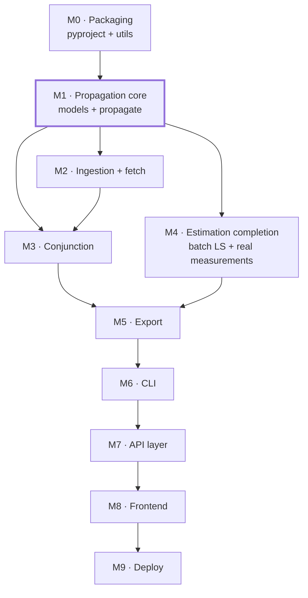

# Ariadne, Roadmap

Sequenced build plan with acceptance criteria. Module responsibilities and
contracts live in [`architecture.md`](architecture.md); the math behind them is
in [`orbital-mechanics-and-estimation-primer.md`](orbital-mechanics-and-estimation-primer.md).

A milestone is done when its acceptance criteria pass under `pytest`, not when
the files stop being empty.

---

## Dependency graph

M1 is the bottleneck: nothing except the already-built UKF internals can be
exercised end-to-end until a `SatelliteState` can be produced.

---

## M0 · Make the package installable

Small, and it unblocks every test run that follows.

- `pyproject.toml`, metadata, `requires-python`, dependencies (`numpy`,
  `scipy`, `sgp4`, `requests`, a CLI framework; `matplotlib` as an extra),
  entry point `ariadne = ariadne.cli.main:main`.
- `utils/time.py`, UTC ↔ Julian Date, GMST, TLE two-digit-year epoch decoding.
- `utils/math.py`, unit vectors, rotation helpers, angle wrapping.
- `utils/logging.py`, logger setup honouring `LOG_LEVEL`.
- `config/settings.py`, env-driven settings (`CACHE_DIR`, `LOG_LEVEL`,
  Space-Track credentials).

**Done when:** `pip install -e .` succeeds, `import ariadne` works from a clean
venv, and JD/GMST conversions match reference values from the primer.

> The entry point can be declared before `cli/main.py` has content, declaring it
> early means the console script is wired the moment M6 lands.

---

## M1 · Propagation core, *critical path*

The blocking milestone. Build in this order; each step is testable against the
previous one.

1. **`models/state_vector.py`**, `SatelliteState` (+ `Frame` enum). Everything
   speaks this type, so it lands first.
2. **`models/tle.py`**, TLE parsing with checksum and column validation,
   raising `TLEParseError` with a line number. Preserve `line1`/`line2` verbatim
   for the `sgp4` package.
3. **`propagate/sgp4.py`**, wrap the `sgp4` package. TEME output converted to
   ECI before returning; error codes → `PropagationError`.
4. **`propagate/frames.py`**, TEME → ECI → ECEF → SEZ → az/el/range. Sole owner
   of all rotations.
5. **`propagate/numerical.py`**, RK4/RK45 over two-body + J2, adaptive-step,
   for non-TLE propagation.
6. **`models/orbit.py`**, Keplerian elements ↔ state, plus period/apogee/perigee.
7. **`models/measurement.py`**, observation container with noise covariance.

**Done when:**
- SGP4 output matches the published Vallado test vectors to documented tolerance.
- Every frame transform round-trips to within numerical noise.
- The numerical propagator conserves energy and angular momentum over a
  multi-day arc (J2 aside), and tracks SGP4 to a sane bound over short arcs.
- `tests/test_propagate.py` is no longer empty.

---

## M2 · Ingestion and live catalogs

- `ingest/sniff.py`, content-based format detection.
- `ingest/tle.py`, `csv.py`, `txt.py`, `schema.py`, all three formats →
  `SatelliteState` / `TLE`, with per-line error reporting and partial-success
  warnings on large catalogs.
- `fetch/cache.py`, **build before the providers.** Disk cache keyed by
  `(provider, query, fetch_date)` with TTL and stale-fallback.
- `fetch/celestrak.py`, `gp.php` with `GROUP=` and `CATNR=` queries.
- `fetch/spacetrack.py`, authenticated flow, credentials from env only. Lower
  priority than CelesTrak.

**Done when:** the same catalog loads identically from a local file and from a
live fetch, a second identical fetch is served from cache with no HTTP call, and
malformed fixtures raise the right exception with the right line number.

> Cache first, providers second. Building the providers first means every test
> run and every dashboard poll hits a free public service.

---

## M3 · Conjunction assessment

Depends on M1 for propagation and M2 for catalogs. Reuses `estimate/`'s
covariance machinery, do not reimplement covariance propagation here.

- `conjunction/relative_state.py`, Δr, Δv on a shared epoch grid.
- `conjunction/tca.py`, coarse `Δr·Δv` sign-change scan, then Brent refinement;
  return all minima in the window.
- `conjunction/ric.py`, RIC basis from the primary's state at TCA.
- `conjunction/probability.py`, Foster/Alfano 2D Pc with combined covariance
  and hard-body radius.
- `conjunction/screening.py`, one-vs-catalog with apogee/perigee overlap and
  coarse range gates ahead of any refinement.

**Done when:** an analytic two-object geometry with a known closest approach is
recovered to sub-second TCA accuracy, Pc matches a published worked example, and
a full-catalog screen against one primary completes in a time worth reporting in
the README.

---

## M4 · Estimation completion

The UKF, dynamics, noise models, and diagnostics are already built. What's
missing:

- `estimate/batch_ls.py`, batch least squares behind a shared estimator
  interface, reusing `dynamics.py` for state transition.
- **Non-identity measurement models**, introduce an `h(x)` callable so the UKF
  accepts range and az/el observations, not just direct position/velocity. This
  is where `estimate/` gains a dependency on `propagate/frames.py` for site
  geometry.
- **Measurement simulation**, synthetic observations with configurable sensor
  noise, feeding the README's measurement-simulation feature and the OD tests.
- EKF, if it earns its place next to the UKF.

**Done when:** batch LS and the UKF converge to the same answer on the same
synthetic arc, and NIS stays inside the chi-square bound for a range/az-el
measurement model, the existing `run_nis_consistency_check` already provides
the verdict.

---

## M5 · Export

- `export/czml.py`, document packet with clock/interval, per-satellite
  time-tagged `position.cartesian` plus path styling, and conjunction geometry
  packets. This is the dashboard's data format; it gets built properly.
- `export/json.py`, `csv.py`, orbit parameters, filtered states, conjunction
  results. These shapes become the API response bodies in M7, so settle them
  here.
- `export/plots.py`, ground track and RIC-plane matplotlib output.

**Done when:** emitted CZML loads in Cesium and animates a correct ground track,
and the JSON shapes are stable enough to be an API contract.

---

## M6 · CLI

`cli/main.py` plus `fetch`, `validate`, `propagate`, `od`, `conjunct`, `screen`
subcommands, argument parsing, one library call, one export call, and an
`AriadneError` handler that prints a message instead of a traceback.

**Done when:** every command in the README's example block runs end-to-end
against real data, and no subcommand module contains numerical logic.

---

## M7 · API layer

New top-level `api/` package. FastAPI over the same functions the CLI calls.

- `GET /catalog`, `GET /objects/{id}/state`, `GET /objects/{id}/orbit.czml`,
  `GET /conjunctions/next`, `GET /conjunctions/screen`.
- Stateless handlers; all persistence via the M2 disk cache.
- Catalog screening needs a background job with a handle, or a pre-computed
  screen on a timer, it is not a request-response operation at catalog scale.
- CORS locked to the frontend origin.

**Done when:** endpoint shapes are frozen and documented. That freeze is what
lets M8 proceed in parallel.

---

## M8 · Frontend

New `web/` directory. CesiumJS globe fed by the CZML endpoint inside a
React/Vite shell: top bar (scenario, UTC clock, object count), left icon rail,
right-hand Orbit Parameters and Next Close Approach panels, bottom object-detail
bar. Dark background, gold (`#e8b04b`) monospace theme.

Depends only on the M7 contract, not on this repo's Python, buildable in
parallel by a separate session once M7's shapes are fixed.

---

## M9 · Deploy

- Backend → Render (persistent process; serverless fights long-running
  NumPy/SciPy work).
- Frontend → Vercel, pointed at the Render URL via a build-time env var.
- CORS for the Vercel domain; secrets from the platform's env store, never
  committed.

---

## Cross-cutting, ongoing

- **Tests land with their module, ** not in a later cleanup pass. The empty
  `tests/test_propagate.py`, `test_ingest.py`, `test_fetch.py`,
  `test_conjunction.py`, `test_estimate.py` fill in during M1–M4.
- **Validation studies**, the README promises benchmarks against real tracking
  data and historical conjunction cases. These belong in `docs/` as they're
  produced, with the numbers reproducible from `examples/`.
- **CI**, run `pytest` on push once M0 makes the package installable.
- **Docs**, API reference and command reference follow M6/M7 rather than being
  written speculatively.

---

## Deliberately out of scope for now

Recording these so they don't get re-litigated: high-fidelity force models
(drag with atmospheric density, SRP, third-body, geopotential beyond J2);
maneuver detection and modelling; multi-target tracking and data association;
GPU/parallel acceleration for catalog-scale screening. Each is a reasonable
extension once M1–M6 are solid, and each is a large project on its own.
